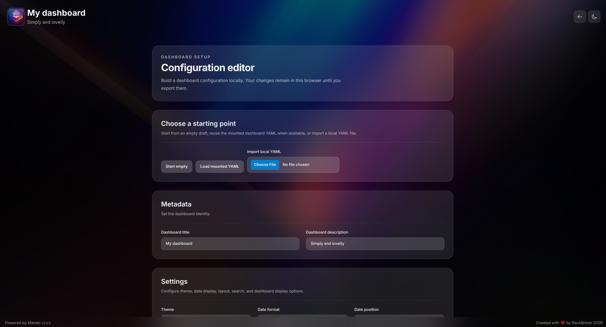

This release adds a browser-based visual configurator for building and editing `dashboard.yaml` through accessible forms, header navigation between the dashboard and the new `/configure` route, and an optional server-side write API so the configurator can save directly to the mounted file.



## Breaking changes

> **⚠️ Action required only if you want to save from the browser.** To let the configurator's new "Save" action write `dashboard.yaml`, mount the config **directory** read-write instead of the old read-only file, and set a write token:
>
> ```yaml
> volumes:
>   - ./config:/app/config:rw
> environment:
>   - CONFIG_WRITE_TOKEN=change-me
> ```
>
> **If you change nothing, nothing breaks.** Without `CONFIG_WRITE_TOKEN`, or with the volume left `:ro`, the dashboard serves exactly as before — only "Save" is disabled, and copy and download stay available.

## New features

- Added a lazy `/configure` route with typed reactive forms for metadata, settings, categories, applications, and bookmarks. Start from an empty draft, load the currently mounted `dashboard.yaml`, or import a local YAML file, then copy, download, or save a validated, canonically serialized result.
- Added an optional Config Write API: a sidecar process bundled into the Docker image exposes `POST /api/config`, validates the submitted configuration against the same schema the browser enforces, then atomically overwrites `dashboard.yaml` (temp file + rename) after rotating the previous contents into `dashboard.yaml.bak`. It requires a shared-secret `CONFIG_WRITE_TOKEN`; without it, every request is rejected and the rest of the app is unaffected.
- Added a "Save" action alongside copy and download in the editor. The first use prompts for the write token, stored in this browser only; a rejected token clears the stored value and re-prompts.
- Added header navigation between the dashboard and the configurator, with the header tracking the active route to choose the gear or back-arrow icon, label, and target.

## Fixes and improvements

- Starting without a mounted `dashboard.yaml` now uses the default dashboard silently and leaves the configurator ready with an empty draft; invalid or unavailable YAML still shows a configuration warning.
- The configurator's "Items per row" setting surfaces its validation error inline with `aria-invalid`/`aria-describedby`, matching the metadata and collection fields.
- Adding a category, application, or bookmark moves keyboard focus to the new item's Name field, matching the existing focus management after Remove.
- Replaced the header emoji controls with Heroicons outline so the gear, back arrow, and theme sun/moon inherit light and dark text color.
- Extended the dashboard schema with cross-collection validation shared by the loader and configurator: unique IDs across categories, applications, and bookmarks; application `category` values that must match a declared category ID; and category IDs reserved for virtual categories.
- Reworked `YamlLoaderService` to preserve distinguishable outcomes (mounted config, runtime fallback, parse or validation errors) so the configurator can accurately offer a "load mounted YAML" entry point.
- Removed an unreachable export path that bypassed schema validation via an unsafe cast; canonical YAML is now only produced from a fully validated `DashboardConfig`.
- The "Powered by Mando" footer credit now links to the product landing page.

## Security

- Updated `@angular/core`, `common`, `compiler`, `forms`, `platform-browser`, and `router` to 21.2.22 and `js-yaml` to 4.3.2, resolving 13 GitHub-flagged advisories reachable from production dependencies. A follow-up `npm audit fix` cleared the remaining build-tooling-only transitive advisories; `npm audit` now reports zero vulnerabilities with no behavior change.

## Quality and tooling

- Added unit and component tests for the configurator routes, store, collection editor, and page component, plus expanded coverage for dashboard model validation, the YAML codec, and the export service.
- Documented the `/configure` export flow, browser-only validation, and the ID-uniqueness and category-reference constraints in the README, regenerated the light and dark dashboard screenshots from the v2.0.0 UI, and rewrote the Docker quick start around the visual editor with a writable config directory mount and `CONFIG_WRITE_TOKEN`.
